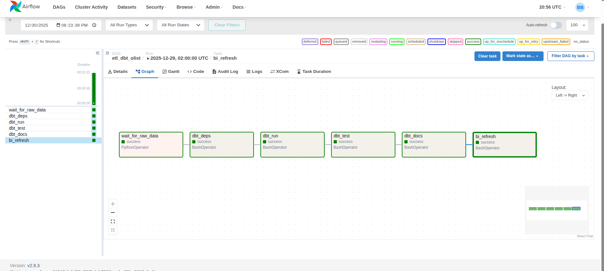
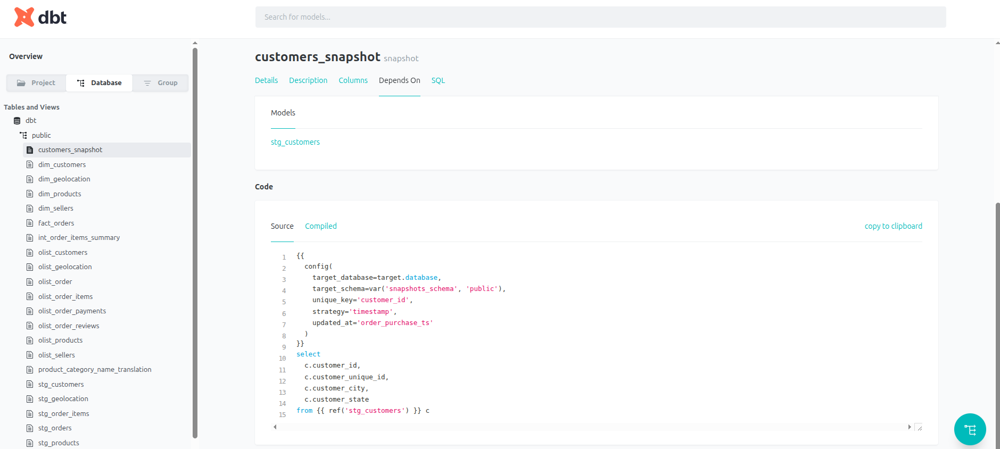

# olist_ebiz

Professional dbt + Airflow analytics pipeline for e-commerce order analytics.

This repository is a production-ready, opinionated implementation of an analytics platform built with dbt (models, tests, docs) and Airflow for orchestration. It's organized and documented to match the standards expected from senior/consultant-level Upwork engagements.

## Highlights ✅
- Clear project structure for staging, marts, and snapshots
- Automated tests and data quality checks (dbt tests and generic tests)
- Airflow DAGs orchestrating dbt runs with robust retries and alerts
- CI-ready: simple GitHub Actions pipeline to run dbt jobs and publish docs
- Includes portfolio and proposal templates oriented for high-value Upwork work

## Quickstart 🔧
Prerequisites: Python 3.9+, dbt-core (and adapter), Airflow (>=2.0), Docker (optional).

1. Install dependencies:

	pip install -r requirements.txt

2. Configure your `profiles.yml` for your target data warehouse.

3. Run locally:

	- dbt deps
	- dbt seed
	- dbt run
	- dbt test

4. Generate docs:

	- dbt docs generate

## Project structure 📁
- `models/` - dbt models (staging, intermediate, marts)
- `macros/` - dbt macros and testing helpers
- `airflow/dags/` - DAGs that orchestrate dbt runs and data quality checks
- `docs/` - project overview, case studies, and Upwork materials
- `tests/` - test harness and integration tests

## Contribution & Standards 🔧
Follow the `CONTRIBUTING.md` guidelines (coming soon): code style, SQL formatting, and how to add tests and docs. We use semantic versioning and a clear changelog for releases.

## Deployments & CI 🚀
This repository includes example CI workflows for running dbt commands and publishing generated docs to artifact storage. See `docs/PROJECT_OVERVIEW.md` for recommended deployment patterns (Docker, Kubernetes, managed Airflow).

## Portfolio materials ✨
See `docs/UPWORK_CASE_STUDY.md` and `docs/UPWORK_PROPOSAL_TEMPLATE.md` for examples of how to present this project to Upwork clients and how a senior consultant would scope engagements at the $100k+ or $1M revenue level.

---

If you'd like, I can: add CI, add Dockerfile & Makefile, extend DAGs with alerting, or draft an Upwork profile summary and pricing sheet tailored to your experience. Which would you like me to do next?

